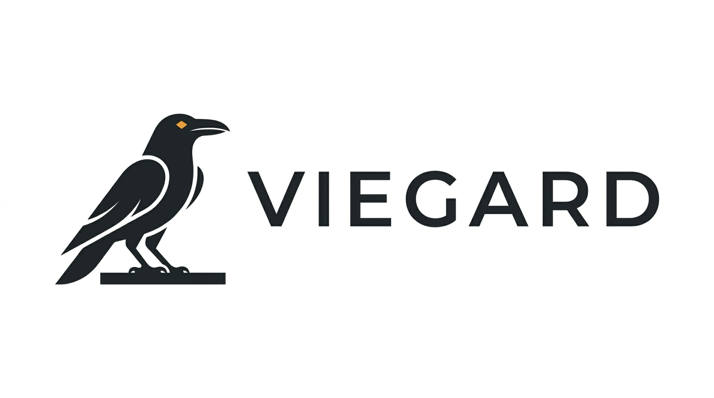

  

# Viegard

Viegard is a modular, self-hosted autonomous monitoring and security platform with local AI inference.

Its conceptual identity is a raven acting as a vigilant sentinel.

Component | Metaphor | Responsibility
----------|----------|---------------
Eyes      | Observation | Data ingestion (IMAP mail, SWAG/nginx logs, future sources)
Flight    | Transport   | Event normalization, transport, and correlation
Mind      | Inference   | Deterministic rules and local LLM classification
Judgment  | Policy      | Policy evaluation and decision-making
Talons    | Actions     | External actions and remediation (email actions, firewall, Fail2Ban)
Roost     | State       | Persistent state and configuration
Ledger    | Audit       | Immutable audit trail for every decision and action

## Status

Viegard is in early development (Phase 1: Discovery / Phase 2: Architecture).  No functional code exists yet.  See [TODO.md](TODO.md) for the current work queue and [DECISIONS.md](DECISIONS.md) for the architectural decision record.

## Initial goals

1. Monitor and manage a Yahoo Mail account via IMAP, including AI-assisted spam classification and carefully controlled message actions.
2. Monitor SWAG/nginx and other infrastructure logs, perform security/threat classification, correlate events into incidents, and take carefully controlled defensive actions.

## Design principles

- **Modular.**  Data sources, classifiers, action providers, and AI backends are pluggable behind clean interfaces.  Adding a new source or action must not require rewriting the core.
- **AI augments; it does not command.**  The local LLM produces schema-validated recommendations.  A deterministic policy engine decides whether any action is permitted.  The platform remains functional when the LLM is unavailable.
- **Safe by default.**  Dry-run is a first-class feature.  Destructive actions (deleting mail, modifying firewall state) must be explicitly enabled.  Protected addresses can never be automatically blocked.
- **Explainable.**  Every automated action is auditable: what happened, what evidence was observed, what the classifiers concluded, which policy matched, and what action resulted.
- **Private.**  Email contents and infrastructure logs are sensitive.  Inference is local by default and never silently falls back to a cloud API.

## Technology

- .NET 10 (LTS), modern C#, worker/service-oriented architecture
- Optional ASP.NET Core administrative API
- Provider-neutral local inference abstraction (llama.cpp first; Ollama, vLLM, and others via adapters)
- Deployed as a Docker container; the core remains deployment-independent

## Documentation

Document | Purpose
---------|--------
[docs/deployment.md](docs/deployment.md) | Deployment runbook: compose stack, verification, and the post-deploy backup restore drill
[DECISIONS.md](DECISIONS.md)   | Living architectural decision record
[TODO.md](TODO.md)             | Unresolved questions, pending decisions, and work queue
[AGENT-README.md](AGENT-README.md) | Orientation for AI coding agents working on this repository
[CONTRIBUTING.md](CONTRIBUTING.md) | Contribution guide
[SECURITY.md](SECURITY.md)     | Vulnerability reporting
[THIRD-PARTY-NOTICES.md](THIRD-PARTY-NOTICES.md) | Third-party dependency licenses

## License

[MIT](LICENSE)
